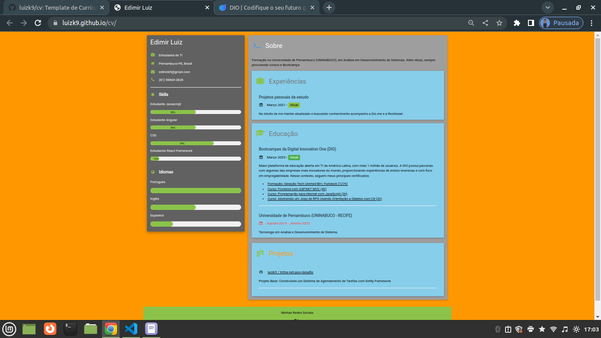

<h1 align="center">  Curriculum Vitae (CV) Online </h1>

  Desafio -Criando Seu Currículo Online Com HTML e GitHub Pages- tem por finalidade uma das etapas do Bootcamp
  Potência Tech Angular Developer - Powered by iFood

  <a href="#-tecnologias">Tecnologias</a>&nbsp;&nbsp;&nbsp;|&nbsp;&nbsp;&nbsp;
  <a href="#-projeto">Projeto</a>&nbsp;&nbsp;&nbsp;|&nbsp;&nbsp;&nbsp;
  <a href="#memo-licença">Licença</a>

  

 

  

## 🚀 Tecnologias

Esse projeto foi desenvolvido com as seguintes tecnologias:

- HTML e CSS
- "https://www.w3schools.com/w3css/4/w3.css
- Git e Github

## 💻 Projeto

 O Curriculum Vitae (CV) tem como intuito ser um aula prática e como também uma oportunidade de elaborar seu próprio portifólio de oportnidades para recrutadores entrar encontato no futuro próximo. O projeto possui modificaçoes proprias como um modal com mais detalhes de perculiaridades.

## :memo: Licença

Esse projeto está sob a licença MIT.

---

Referência W3C: https://www.w3schools.com/howto/howto_website_create_resume.asp
